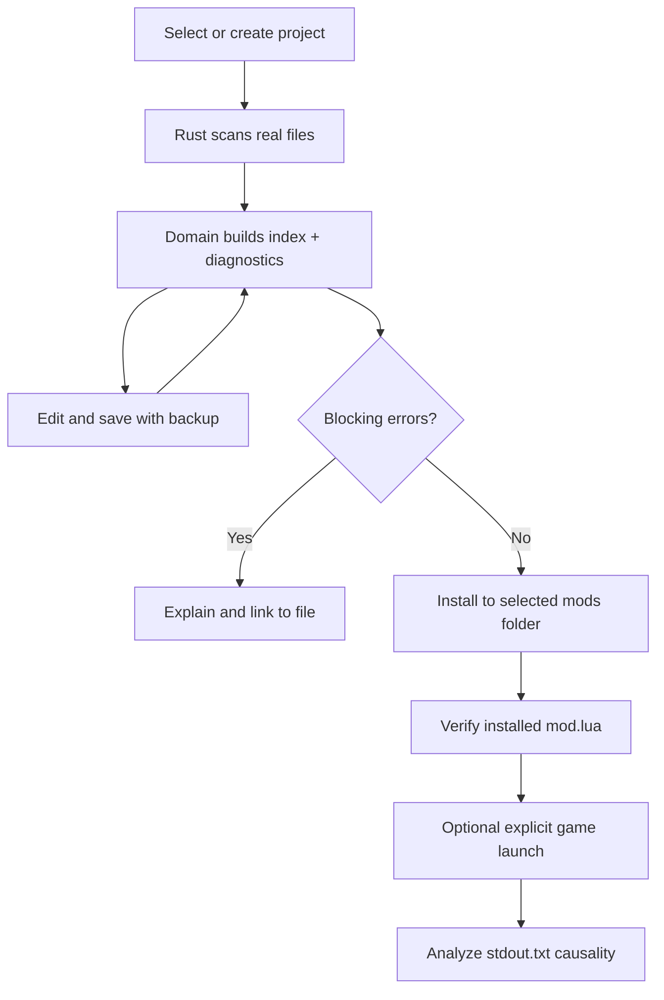

# Architecture

## Boundaries

| Boundary | Responsibility | Write authority |
| --- | --- | --- |
| React workbench | User interaction, editor state, views | None directly |
| Domain core | Static validation, index, log interpretation | None |
| Desktop bridge | Typed IPC contract and error normalization | None |
| Rust commands | Path validation, atomic saves, copies, process launch | Explicit project/target only |
| TF2 installation | Game resources and executable | Read-only |

## First vertical workflow

## Package map

- `packages/core`: pure domain contracts, TF2 load/modifier knowledge,
  validation, index and causal log analysis.
- `packages/core/src/node-service.ts`: test/developer real-filesystem adapter.
- `apps/desktop/src`: React workbench and Tauri bridge.
- `apps/desktop/src-tauri`: native command layer and Tauri configuration.
- `docs`: decisions, evidence, security and verification status.

## Data integrity

Project scans are read-only. Saves first write a sibling temporary file, create
a versioned backup under `.tpf2-studio/backups`, then replace the target.
Installs copy into a temporary sibling directory and rename only after
verification. Existing targets require explicit overwrite consent and are moved
to a timestamped backup before replacement.
